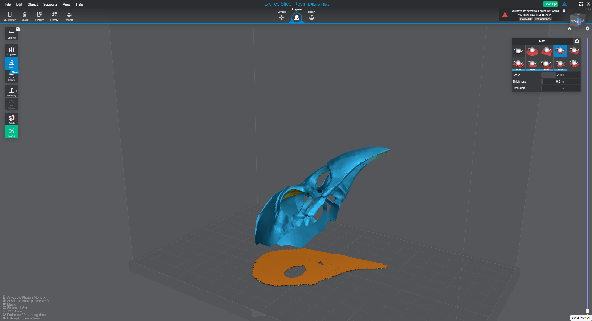

# Resin Printing Guide

This is a complete guide for everything you need to know for resin printing. Most of it is based on memory so my apologies if something critical is missing. This may look like a lot of information, because it is... but just know that I did not learn this in one day. It took me many weeks of experimenting to understand the nuances related to resin printing. I have a ton of experience with 3d modeling programs and slicers so this sped up the learning curve. I'm hoping relaying some of this knowledge will do the same for you and make resin printing a more enjoyable experience.

### Modeling Software

Download, install, create accounts for all of these things. Lychee and Blender will probably be the most important software but Fusion also comes in really handy when you decide to make mechanical parts.

- [Lychee Slicer](https://mango3d.io/downloads/)
    - Used to arrange, slice, hollow, and support models.
    - A 'slicer' outputs files that can be ran from your printer. It translates a 3d model into a set of instructions your printer can understand.
- [Blender](https://www.blender.org/download/)
    - Used to create 3d models.
    - This program is for 'mesh modeling' where you may be sculpting organic features or models.
    - It's also great for merging different models together.
- [Fusion 360](https://www.autodesk.com/products/fusion-360/personal)
    - Used to create 3d models.
    - This program is for 'parametric modeling' where you explicitly define each dimension of your model.
    - Commonly used for engineering precise parts and doesn't do well with more organic shapes.

### Tools

To make your life easier there's an array of accessories I'd recommend. Believe it or not there is a use for all of them.

- Safety Glasses
- Chemical Resistant Gloves
- Toothbrush
    - For cleaning parts during the wash process. 
    - Any old one will work.
- Cheap Paper Towels
    - You'll need a lot of these to clean *everything*.
- Small Trash Can
- Small Funnel
    - For transferring resin from the vat back into the bottle.
- Small Rubber Spatula
    - For mixing resin in the vat.
- Single Piece of Printer Paper
    - For build plate leveling.
- [Calipers](https://www.amazon.com/Digital-Caliper-Adoric-Calipers-Measuring/dp/B07DFFYCXS/ref=sr_1_3?crid=7RA9ZBJY1JVX&keywords=calipers&qid=1693071230&sprefix=caliper%2Caps%2C137&sr=8-3)
    - Not useful for printing or cleaning but very useful when you need to make your own replacement parts. Typically these are not contaminated.
- [Metric Allen Wrench Set](https://www.amazon.com/GEARWRENCH-Piece-Metric-Ball-Long/dp/B098TYMJ3X/ref=sr_1_5?keywords=metric+allen+wrenches+set&qid=1693068581&sprefix=metric+allen+%2Caps%2C146&sr=8-5)
    - You really only need this for printer disassembly or leveling the build plate.
- [Paint Filters](https://www.amazon.com/TCP-Global-Strainers-Micron-Filter/dp/B000PA09V0/ref=sr_1_5?crid=2GUET8LOTPDUV&keywords=paint+filter&qid=1693068185&sprefix=paint+fi%2Caps%2C268&sr=8-5)
    - Useful for straining the resin when pouring it from the vat back into the bottle.
- [Glass Cleaner](https://www.amazon.com/Sprayway-443331-Ammonia-Cleaner-Packaging/dp/B07J22J33Q/ref=sr_1_5_pp?crid=3V66QC21B0A5S&keywords=glass+cleaner&qid=1693065872&sprefix=glass+cleane%2Caps%2C131&sr=8-5)
    - Great for cleaning tools and random blobs of resin spilled during transfer.
- [Respirator](https://www.amazon.com/3M-62023HA1-C-Professional-Multi-Purpose-Respirator/dp/B002NMICB2/ref=sr_1_17?keywords=3m+respirator&qid=1693065354&sprefix=3m+resp%2Caps%2C125&sr=8-17)
- [Heavy Duty Gloves](https://www.amazon.com/Chemical-Gloves-Pairs-Hands-Waterproof-Handling-Industrial/dp/B08FDMCVR1/ref=sr_1_6?keywords=chemical+resistant+gloves&qid=1693065418&sprefix=chemical+%2Caps%2C140&sr=8-6)
- [Needle Nose Pliers](https://www.amazon.com/WORKPRO-Comfort-Handles-Wrapping-Supplies/dp/B0B8SNTD7G/ref=sr_1_23?crid=381YVAZLWVKR&keywords=needle+nose+pliers&qid=1693063976&sprefix=needle+nose+pliers%2Caps%2C131&sr=8-23)
    - Long ones are ideal for breaking away supports in difficult areas.
- [Mallet](https://www.amazon.com/Coghlans-9460-Rubber-Mallet/dp/B000E24HKS/ref=sr_1_6?crid=30KSV6F69UQTI&keywords=rubber+mallet&qid=1693063688&sprefix=rubber+mallet%2Caps%2C134&sr=8-6)
    - Mainly used to tap the scraper if something is really stuck to the build plate.
- [Metal Scraper](https://www.amazon.com/Stainless-Cleaning-Supplies-Barbecue-Restaurants/dp/B01B3SL1UA/ref=sr_1_16?crid=Q8Q49HH6ZZEB&keywords=metal+scraper&qid=1693063608&sprefix=metal+scraper%2Caps%2C158&sr=8-16)
    - Your printer might have come with one of these.
- [Silicone Mats](https://www.amazon.com/gp/product/B08167L48T/ref=ppx_yo_dt_b_search_asin_title?ie=UTF8&psc=1)
    - Get two of these. Set your tools, uncured models, build plate, etc on them. They are easy to clean and keep resin from getting everywhere.
- Alcohol
    - [99%](https://www.amazon.com/s?k=99%25+alcohol+1+gallon&i=industrial&crid=4R5VA5H5H8HO&sprefix=99%25+alcohol+1+gallon%2Cindustrial%2C124&ref=nb_sb_noss_1)
    - [Denatured](https://www.lowes.com/pd/Crown-128-fl-oz-Fast-to-Dissolve-Denatured-Alcohol/3024059)
        - This is usually much cheaper and locally obtainable but more toxic than 99%. However you should avoid breathing either of these.
- [2qt Airtight Container](https://www.amazon.com/gp/product/B08SQJTRRJ/ref=ox_sc_saved_title_1?smid=A2J1A23FOXKV96&psc=1)
    - Useful for a second wash container.
- [Heat Gun](https://www.amazon.com/TDAGRO-Temperature-Settings-Cordless-Protection/dp/B0BHL8YZTT/ref=sr_1_5?crid=ZU6DBZWD3KUZ&keywords=heat%2Bgun&qid=1693065158&sprefix=heat%2Bgun%2Caps%2C181&sr=8-5&th=1)
    - Useful for drying parts after the wash.

### Safety

If you don't pay attention to anything else in this guide, please pay attention to this. Safety is key when working with resin. Almost everything about the printing, washing, and curing processes are toxic in some way. Ventilation and extraction are key. There are several ways to complete this. Probably the best one I've seen, although it is a bit extreme, is to set up everything inside of a grow tent. Then get a grow tent fan to extract the air out the window. This creates a fume hood of sorts. Your printer, washing station, and curing station would have to be inside of this tent so the setup can be quite large.

Aside from this I'd recommend setting up in the garage. As long as you wear the respirator you shouldn't have to open the door but opening the door is always best. Avoid breathing in resin and alcohol fumes for extended periods of time ( more than 5 minutes ).

Unfortunately you can't just put everything outside because the resin will cure immediately when exposed to sunlight. Even a heavily shaded area has enough UV rays to start the curing process. The same goes with the washing container. Resin dissolved into the washing medium will still cure into a gelatinous blob making it completely unusable.

Anything you put at your resin station stays at your resin station. Treat it as contaminated and never touch it without gloves. The only exception is if you take the tool outside for a few hours to cure in the sun then it could be used for other things. However I do not do this. It's cheap enough to have a spare set of tools just for resin printing.

Safety glasses should be worn when removing supports or dealing with washing liquids. You don't want a stray uncured resin support to bust off into your eye. Same for denatured / rubbing alcohol contaminated by dissolved resin.

Gloves should be worn at all times. Try to keep your fingers out of resin or alcohol. Using the long needle nose plier to grab and transfer items is ideal. If you have to hold the part in your gloved hand use a paper towel as a buffer between the part and your glove. It is possible for the liquids to penetrate the glove as they are always 'chemical resistant' and never 'chemical proof'. When removing your gloves take care to start pulling them off at the fingers to keep the cuff ( which touches your forearm ) as clean as possible.

Long term exposure to any of this stuff can cause a buildup in your system which can lead to some pretty severe allergic reactions. Head aches, eczema, palpitations, etc.

As a side note, a lot of people use disposable nitrile gloves but they are not as chemically resistant as a more heavy duty pair. You should replace the heavy duty pair every once in a while if you find your fingers smell of alcohol or resin.

Finally, always wash your hands when you are finished working with these materials.

### Resins

There are several kinds of resins and many different brands, colors, etc. Good brands include Siraya Tech, AnyCubic, and Elegoo. I'll cover a few types here. Keep in mind that a more advanced setup may include blending multiple different resins to get the desired characteristics. ( brittle vs flexible for example ). Also keep in mind that different colors will have different cure times and the printing characteristics can slightly change those times. It is important to calibrate your settings to match the resin you are using. More on that later.

#### Recommended

- [Standard Resin](https://www.amazon.com/ANYCUBIC-UV-Curing-Precision-Excellent-Fluidity/dp/B07G3663HD/ref=sr_1_4?crid=2OPAVJ1AJUDC&keywords=3d+printing+resin&qid=1693064533&sprefix=3d+printing+resin%2Caps%2C133&sr=8-4)
    - This type is the defacto standard and probably the best starting point.
    - It is not water washable.
    - It is typically strong but brittle. Good for minis, diorama, etc.

- [Water Washable](https://www.amazon.com/ANYCUBIC-Viscosity-Precision-UV-Curing-Photopolymer/dp/B09X2TF8V8/ref=sr_1_5?crid=2TU3YTNC07TSR&keywords=3d%2Bprinting%2Bresin%2Bwater%2Bwashable&qid=1693065015&sprefix=3d%2Bprinting%2Bresin%2Bwater%2Bwashable%2Caps%2C141&sr=8-5&th=1)
    - This has the same characteristics as Standard Resin but it is, obviously, water washable.
    - Unless you're using hot water in an ultrasonic cleaner, it's still likely you'll have leftover residue on your parts causing white spots after curing.
    - For that reason I still like to wash this in alcohol.
    - Do not wash this in the sink. Just because it is water washable does not make it safer than Standard Resin.

#### Supplemental

- [ABS Like](https://www.amazon.com/ABS-Like-Curing-Non-Brittle-Printing-Resin/dp/B07WFJ53LP/ref=sr_1_3_pp?crid=N7CNFJL1ZMEI&keywords=abs+like+resin&qid=1693065469&sprefix=abs+like+resin%2Caps%2C118&sr=8-3)
    - This resin is usually a bit more expensive but is also much stronger than Standard Resins.
    - It can be useful for making mechanical parts that are undergoing a lot of stress.

- [Blu / Tough Resin](https://www.amazon.com/Blu-Strong-Precise-Resolution-Printing/dp/B083DLSR1W/ref=sr_1_3_pp?crid=5O5W46676ZYH&keywords=tough+resin&qid=1693065561&sprefix=tough+resin%2Caps%2C123&sr=8-3)
    - Blu is more of a name and less of a color in this case.
    - This is engineering grade resin and even stronger than ABS Like.
    - However it's more expensive and generally more difficult to clean / print with.

-  [Tenacious / Flexible Resin](https://www.amazon.com/Tenacious-Flexible-Resistant-Siraya-Tech/dp/B07PLJ9XW9/ref=sr_1_6?crid=1J1L02Z7RSSTB&keywords=flexible+resin&qid=1693065649&sprefix=flexible+resin%2Caps%2C121&sr=8-6)
    - Although it is expensive, this type of resin maintains flexibility after it's cured. Almost like printing with rubber instead of plastic.
    - It can be mixed with other resins to form a custom polymer with limited flexibility. ( advanced )

#### Colors

Since this resin is cured by UV light you must consider how much light passes through any given color. For instance, a clear resin will allow a lot of light to pass. This means that you have to adjust your layer exposure time, or that detail may be lost due to extra light passing through. Black would be the total opposite. If you plan on painting your prints, just use grey because it really provides the best of all worlds.

### Printer Setup

The most important part of printer setup is leveling your build plate. It sets the distance for the first level and provides plate adhesion when printing your burn in layers. Typically you only need to do this once and it is a fairly simple process. I normally leave my printer on and may repeat the process after a power outage if I think the first level alignment is out.

1. Remove your build plate.
1. Remove the resin vat.
1. Go to the move plate menu of your printer and tap the home icon. This will move your printer head to the home position.
1. Loosen the four bolts on the build plate meant for leveling.
    - At this point your build plate should be loose and able to shift orientation.
1. Put a piece of paper over the exposure screen.
1. Carefully place the loose build plate back on the print head.
1. With the build plate attached, drive the printhead down by a few millimeters.
    - Pay special attention here to ensure there is room for the bolt slots to slide. Don't press the build plate into the screen.
1. Tighten the four leveling bolts in a cross pattern taking care to apply even pressure on all sides.
1. Use the Z=0 option on your printer to zero out the Z axis.
1. Manually raise the build plate by 10mm or more.
1. Tap the home button.

This should do a few things. First it should level your build plate inline with the screen plane. This provides even light exposure and bed / layer adhesion. Secondly it should set the zero distance for the first layer. This distance is roughly the thickness of a piece of paper. Finally it should mean that your home distance is a few mm above your zero distance. This helps prevent the homing operation from squishing the screen and provides a small layer of protection against cracking it.

### Pre Printing Setup

I'll cover this first because you will end up leaving a good amount of resin in the vat. It's very tedious to clean it all out every time you are finished using your printer.

1. Assure the build plate is secure and the knob is tight.
1. Use a rubber spatula to stir your resin. There are two things you are looking for here.
    1. Broken bits of cured resin left over from print failure. Your build plate will crush these into your screen and crack it. All of the resin in the vat should be liquid. If it isn't it's best to filter the resin back into the bottle, clean the vat, and re-pour.
    1. Resin pigment will settle into the bottom of the vat after it hasn't been used for a while. This pigment will cover the fep ( plastic sheet at the bottom of the vat ) and prevent light from passing through. Stir this as much as possible.

There is an alternative technique you can use here. After giving the resin a good stir you can use the 'exposure check' function to light up the whole screen for around 10 seconds. This will cure the bottom layer of the build plate and then you can peel it out in one whole sheet. A bonus tip is to throw a leftover support in the corner so it adheres to that and you have something to grab and pull on. If you have a print failure, use this technique to ensure any broken off / cured resin from the failed print is removed from the vat.

It's generally best to keep your vat about half to three quarters full. Avoid filling it up to the max line because things can get messy. You can always slowly pour a bit of resin in there mid print if needed.

### Post Print Cleanup

Since there isn't much to printing other than pressing start, I'll skip to this. We'll come back to setting up a print later because that's where all of the detail is. I just want you to get a understanding how to physically operate the printer before diving into the software aspect. 

Typically I follow these steps when removing a finished print.

1. Remove printer / cure station covers.
1. Loosen build plate knob.
1. Remove build plate and transfer it to the silicone mat. Place it upside down with the print facing up. This will angle the build plate making the next step easier.
1. Use the metal scraper and optionally a mallet to remove the print by scraping under the raft. This will require some pressure but you should be able to pop it right off.
1. Put the print into the dirty wash container and close the lid.
1. Put the build plate back onto the printer, tighten the knob, and put the cover back in place.
1. Let the print sit in the dirty wash for a minute or so, giving the container a light shake.
1. Remove the print from the dirty wash container and into the clean wash container.
1. Run the clean wash for a few minutes.
    - Using a two stage wash will extend the life of your alcohol. ( more on that below )
1. Remove the print from the clean wash.
1. Break the model away from the supports and discard the supports.
    - Most supports you can break away by hand but some require the long needle nose pliers.
1. Use the heat gun on low to fully dry the model.
1. Place the model into the curing station and let it run for 4-8 minutes per side.
    - Usually I'll flip the model over and run a second cure to ensure all surfaces have adequate UV exposure.
1. While waiting on the cure clean up your tools using glass cleaner and paper towel. It is not necessary to clean the build plate.
1. Remove the model from the cure station and you're done.
    - Additionally I might open the garage to air it out before going back inside.

If it seems like a lot just accept that a natural part of resin printing is cleaning. You will get used to the process and it will become natural. There is no good way to avoid it and the only good way to learn is by doing. You want your prints to be as clean as possible before curing them because any leftover residue will be noticeable after the cure. Usually you end up with white discolorations on the model's surface.

As you clean parts your dirty wash will become saturated and eventually will stop cleaning parts. You'll notice a very slimy resin like residue still remains on the part. At this time it is probably best to replace the dirty wash alcohol. I recommend getting an old bucket. Stir and pour the dirty wash into that bucket and allow it to evaporate as much as possible outside in the shade. From there it would have to go to chemical disposal but you'll have to look up regulations for your city.

Additionally, if you know you won't be printing for a while, you may want to filter the resin out of the vat and back into the bottle. Then use glass cleaner and paper towel to clean your vat and build plate. When doing this make sure everything is as clean as you can possibly get it. You may consider using some [Rain X](https://www.amazon.com/Rain-X-800002250-Glass-Treatment-Trigger/dp/B000BVRZ74/ref=sr_1_1?keywords=Rain-X&qid=1693071053&sr=8-1) spray on the fep as a last step which prevents anything from sticking to it.

### File Formats

Before we really get into it we should cover file formats. Typically when you think of file formats you may think of `.pdf` or `.jpg`. 3d modeling programs have their own file formats for specific use cases. Different formats are used at each stage of the operation.

- `.stl` 
    - Most common model 3d model format. When you are downloading models from the internet, or exporting your own from Blender / Fusion you'll want to export `.stl`. These files can be imported into the slicer.
- `.3mf` 
    - Newer version of a `.stl` but it is largely the same thing used for the same purpose.
- `.blend` 
    - This is your Blender workspace where you'd do sculpting, model modification, or model creation before exporting the model as `.stl` or `.3mf`.
- `.lys` 
    - This is the file type for a Lychee workspace. Here you will define printer settings, create supports, arrange, or slice models in preparation for printing.
- `.pwmx` 
    - This is the final file format which is exported from a Lychee workspace and will make its way onto your USB stick to be selected for printing.

### Resin Calibration

Ok, with all of that out of the way we can start to talk about calibrating your resin. This involves everything above plus setting up your first prints and getting familiar with the slicer. Keep in mind exposure settings are not only color, resin type dependent, but temperature dependent as well. The ambient temperature of your environment will dictate exposure times. You will find that in colder weather ( < 70F ) a bit of time will need to be added as the resin is more viscous and takes longer to cure.

First you'll want to download [this model](https://github.com/kevinchatham/ResinPrintingGuide/blob/main/Calibration.stl) and have Lychee installed on your computer. Download button is in the top right of the page preview.

What we plan to do here is print several of these at different exposure times. Then we compare all of the results to select which time produced the best looking model. Then we make note of the exposure time for that given resin and color.

Here is a intro video to explain the basics of Lychee. [link](https://www.youtube.com/watch?v=sHp74c5dt2I)

Import the model above and arrange it flat in the center of the build plate. No supports are required. Normally you would want this print to be angled on all axises but for this print we will break those rules. 

Example

From there go straight to the Export tab and select your Printer from the menu on the right. Do note that you may have to add a new printer. This is a fairly straightforward process where you follow the dialog to select your printer from the list. It will also come with a default printing profile which we will optimize.

After some configuration you should be able to see a menu like this where you will select Edit and end up on the properties screen.

Export Tab

Printer / Resin Management Dialog

Printer / Resin Management Dialog

At this point configure your resin settings with the same ones I am using above. I have found this to be very reasonable for grey resin. Let's go over this one by one.

#### Burn In Layers

This is how many layers your printer will use to 'burn' the first layers to the build plate. The extra time here ensures there is a strong bond between the resin and build plate.

Number of Layers: 4
Exposure Time: 45 seconds

#### Speed

After each layer the bed will left / retract at at this speed. Lift Speed is the speed that the plate will raise and Retract Speed will control how fast it will lower.

Lift Speed: 1 mm/s
Retract Speed: 3mm/s

#### Normal Layers

This is where the difference happens. Most adjustments you make will be here.

Layer thickness: .05mm
Light-off delay: 1 second
    - This waits before exposure on each layer to ensure resin has had time to settle.
Exposure Time: 1.5 seconds
    - Arguably the most important setting. For this test we will print models incrementing by a quarter of a second, starting with 1.5.
    - To clarify this means you will want to make calibration prints for 1, 1.25, 1.5, 1.75, and 2 seconds of exposure time. When you understand which quarter works better you can split the difference and really hone in the time. I will say that .05 to .1 seconds is enough to make a noticeable difference.
Lift Distance: 3mm
    - This is how far the build plate will lift off of the fep between each layer.
    - Do not go lower than 3mm. Going any higher just increases print time with no benefit.
    - For reference a print with 6mm lift height will take roughly twice as long as one with a 3mm print height.

Set your resin price, for cost estimates, and everything else here is really optional and you probably won't find a need to use it.

Click Ok / X to get back to the Export preview and select "Export Slices to file" which will prepare your model. While you're here go ahead and export several different exposure times and save them all to your USB Stick. Then go print and clean each one! This gives you plenty of practice before wasting resources on larger prints.

#### Results

Mark and closely compare each print to understand which exposure times are best for your environment. Holes should be correctly sized, all lines should be crisp and clean. You should be able to see the finest details. Split the quarters as necessary and keep at it until you're happy with the result. The better this calibration print is the better all of your prints will be!

### Arranging and Supporting

In the calibration above we skipped over some of the most important steps of slicing any 3d model. Arranging and Supporting. Models will be arranged in the 'Layout' tab of Lychee which you have some experience with at this point. Here we will cover more detail and also cover the 'Prepare' tab.

#### Arrange

In this tab you will orient the model on the build plate to prepare for the next steps. Always align your model centered with the build plate. If you select your model and click the Arrange tool, you will see a button to Arrange All. This does the job of arranging one or more models around the center of the build plate.

Along with this about 5mm of distance will be added to the Z axis to lift the model off of the build plate. The goal is to suspend the model by the supports so it is never touching the build plate directly. Allowing the model to touch the build plate will create a 'elephants foot' on the bottom layers making them larger and flared out compared to the rest of the print. This is mainly because of the extra exposure time where the resin slightly expands and increases the dimensions.

Going on to the rotate tool, just understand it's a bit of an art. There are some general guidelines, but generally you must experiment and learn the effects of model rotation as you go. The basics of it are that you want the models pretty side to be facing away from the build plate. X and Y axises should both be rotated around 30 degrees ideally. This points the model upwards at an offset angle so that the minimum amount of surface area is exposed at any given time. There is an auto rotate tool but it doesn't always do what you want so learning how to do this manually is ideal. Here's an example of a properly rotated model.

Front

Right

Top

Perspective

#### Prepare

Moving to the 'Prepare' tab we can start to set up rafts, hollowing, and support. First you will note the yellow areas which need to be supported.

Thankfully we do not have to place these manually. We'll come back to it in a moment but let's set up a raft and hollowing first.

Select you model, then the Raft tool. I prefer to use the Pixellate raft as it seems to use the least amount of material. Default settings are ideal.

Next go to the hollowing tool. Your model may have large bodies and hollowing them allows you to save a lot of resin. Getting this setup is pretty straightforward. First click the Hollow tool and start by adding a hole. This hole allows unused resin to drain back out into the vat. Having this faced downward on a models ugly / unseen surface is ideal. Just click on the model to add a hole, use control + z to undo. I use a 5mm diameter and 5mm penetration to make things easy. Just make sure the penetration doesn't go all of the way through your model.

After that navigate to the Hollowing 2D tab in the same tool. Turn it on. You will see a preview of what the hollow cavities will look like. I have found that a 2.5mm wall thickness and 20% infill pattern provides plenty of internal support. I haven't placed any images here because the model I have at hand is thin enough to not require hollowing.

From this point it is time to set up the supports. Click on the Support tool. In the dialog select the Light preset. Anything above that causes supports to be difficult to remove. In the section slightly below click the down arrow on 'Generate Automatic Supports' and select 'Supports on Ground Only'. This will generate and optimize model supports. Typically you only need supports on ground but sometimes you may just choose to 'Generate Automatic Supports' which will just generate additional supports to remove.

There are a few things to note here. The first thing is the Layer Preview slider on the right hand side of the screen. This allows you to see all of the slices and ensure each section of the model is appropriately supported. What that means is there should be no overhang greater than 45 degrees and the supports should build up to each island of the model so the entire model is always lifted by the build plate.

It is likely that automatic support generation may have added a few unneeded supports here or there. Those can be cleaned up in this tool by selecting the support and using the delete key on your keyboard. Inversely they may be added back by simply clicking on a region to support in the model. More advanced specifics can be found on YouTube by searching 'Supporting Models in Lychee' or something similar.

At this point you are ready to export your model with the optimal printer settings, load it onto your USB stick, and start printing! All other models will follow this pattern and you will find each step to become more natural with additional practice.

### Modeling

Getting into creating your own models is an entirely different can of worms. I would recommend that you print models that are made by others until you are comfortable with everything above. Many models offered by creators also come pre-arranged/supported so all you have to do is slice them!

When you're ready to take the next steps there are two primary schools of modeling. Parametric and Mesh.

#### Parametric

For this you will need to learn Fusion 360. There is also a newer product called OnShape but, to be honest, I haven't used it yet. I've been using the hobbyist level of Fusion for years so I haven't found the need to migrate.

In Parametric you extrude or revolve shapes with specific dimensions off of a 2d plane or axis. This allows you to create parts with extremely specific dimensions and is primarily useful for creating functional parts. You wouldn't use this to sculpt minis but instead to create storage containers, replacement parts, etc. Then those parts are exported as `.stl` before being imported into Lychee.

Here is a tutorial that should cover all of the basics to get you up and running. [link](https://www.youtube.com/watch?v=D0TYcB-2_8o)

- Note: Personally I have not watched it but looking at the timeline it seems to cover quite a bit.

#### Mesh

Blender is the appropriate application to use for Mesh modeling. It struggles to make parts with precise dimensions. Here you are molding a mesh of n-gons to make any shape you can imagine. Beyond mesh editing this program introduces sculpting which can be used to mold the mesh and add fine detail, as if you were sculpting digital clay. Like the above you can export the model as an `.stl` and import it into Lychee for slicing.

The most well-known tutorial for Blender is the donut tutorial. Here is a link for that. [link](https://www.youtube.com/watch?v=nIoXOplUvAw&list=PLjEaoINr3zgFX8ZsChQVQsuDSjEqdWMAD)

The particular section's you'll want to pay attention to are Editing, Modifiers, Modeling, and Sculpting. Rendering, Texturing, etc is for when you want to make photorealistic renders ( images ) of your object or get into movie creation ( like animated pixar films ).